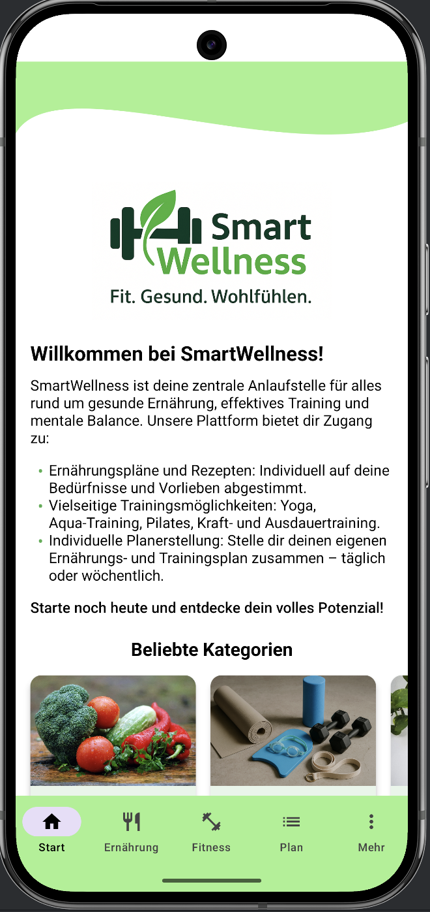
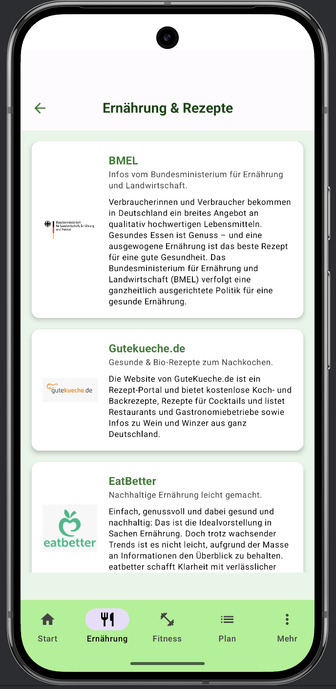
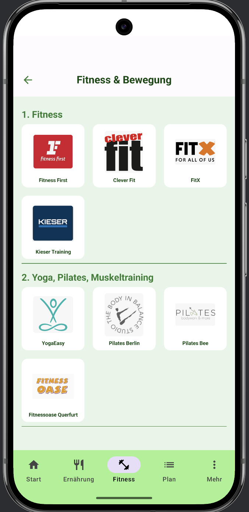
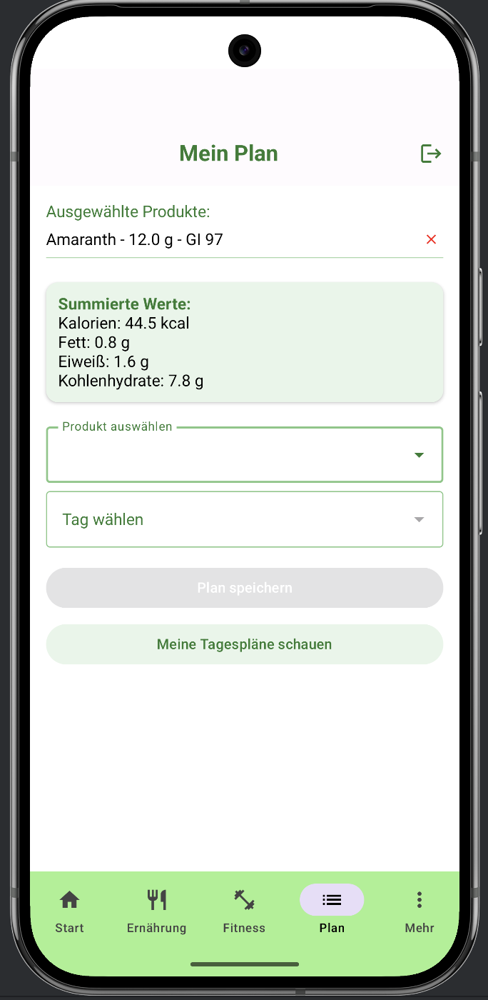

## Projekt Titel  
**SmartWellness** (Meine Android-App für das Kotlin-Prüfungsprojekt)

## Beschreibung  
SmartWellness ist deine All-in-One-Android-App für gesunde Ernährung, Fitness und Stressabbau. Mit modernem Jetpack-Compose-UI, lokaler Room-Datenbank und Firebase-Sync bringt sie dir Rezepte, Trainingsangebote und personalisierte Pläne direkt auf dein Smartphone.

#### Ernährungsangebote  
In diesem Bereich verlinkt SmartWellness auf renommierte Webseiten mit hochwertigen Rezepten und Ernährungstipps. Statt mühsam selbst nach Ideen zu suchen, findest du hier fertige Menüvorschläge für jede Tageszeit – von ausgewogenen Frühstücksideen bis zu leichten Abendessen.

#### Fitness & Bewegung  
Ob klassisches Studio-Training, Yoga oder Aquafitness – SmartWellness präsentiert dir eine Auswahl an aktuellen Anbietern vor Ort und im Netz. Über eine übersichtliche Kachel-Ansicht (“Beliebte Kategorien”) gelangst du direkt zu den Webseiten der Studios und Anbieter, die dir unterschiedliche Kursangebote, Trainingspläne und Bewegungsprogramme vorstellen.

#### Personalisierte Ernährungspläne  
Für Fortgeschrittene und alle, die mehr Kontrolle wünschen, bietet die App einen interaktiven Planer: Wähle Lebensmittel aus einer umfangreichen Datenbank, und SmartWellness berechnet automatisch Kalorien, Fett, Eiweiß, Kohlenhydrate und glykämischen Index. Schritt für Schritt entsteht so dein individueller Ernährungsplan, ohne dass du selbst rechnen musst.

## Features

- **Deklarative UI mit Jetpack Compose (Material 3)**  
  – Alle Screens als `@Composable`-Funktionen  
  – Material3-Components für konsistentes Design (Buttons, Cards, Snackbars, TopAppBar…)  
- **Navigation Compose**  
  – `NavHost` & `NavController` für einfache Routen (Home, Ernährung, Fitness, Plan, Mehr)  
  – Übergabe von Argumenten über sichere Typen  
- **Lokale Persistenz mit Room**  
  – Entities: `Plan`, `User`, `Lebensmittel`, `AuswahlEintrag`  
  – DAOs für CRUD-Operationen (`PlanDao`, `UserDao`, `LebensmittelDao`)  
  – Auto-Migrations und SQL-Compile-Time-Checks  
- **Repository-Pattern**  
  – `PlanRepository` kapselt DAO-Aufrufe  
  – Einfache Austauschbarkeit durch MockK in Unit-Tests  
- **Firebase-Integration**  
  – **Firebase Auth** (E-Mail/Passwort-Login) mit Coroutines (`.await()`)  
  – **Cloud Firestore** für Synchronisation von Essens- und Trainingsplänen  
- **State Management & Side-Effects**  
  – `remember { mutableStateOf(...) }`, `mutableStateListOf(...)`  
  – `LaunchedEffect`, `SnackbarHostState` für asynchrone Effekte und Feedback  
- **CSV-Import**  
  – `LebensmittelImporter` liest `Lebensmittelliste.csv` aus `assets/`  
  – Vollständige Nährwertdaten (Kalorien, Fett, Eiweiß, Kohlenhydrate, glyk. Index)  
- **Testing**  
  – **Unit Tests** mit JUnit4 & MockK (`PlanRepositoryTest`)  
  – **Instrumented Tests** für Room-DAOs im In-Memory-DB (`PlanDaoTest`)  
  – **UI Tests** mit ComposeTestRule (`PlanScreenTest`)  

---

## Architektur & Tech Stack

| Schicht            | Technologie / Bibliothek                             | Zweck                                                     |
|--------------------|------------------------------------------------------|-----------------------------------------------------------|
| **UI**             | Jetpack Compose (Material 3)                        | Deklarative Screens, Themes, Composables                  |
| **Navigation**     | Navigation Compose                                  | Routing, Back-Stack, Deep-Links                           |
| **Daten-Layer**    | Room (androidx.room)                                | Entities, DAOs, `RoomDatabase`                            |
| **Repository**     | Eigene Klassen (`PlanRepository`, `UserRepository`) | Geschäftslogik, Daten-Abstraktion                         |
| **Cloud & Auth**   | Firebase Auth, Firebase Firestore                   | Nutzer-Login, Cloud-Sync von Plänen                       |
| **Asynchronität**  | Kotlin Coroutines                                    | `suspend`-Funktionen, `runTest`, `await()`                |
| **State Mgmt.**    | Compose State APIs                                  | `mutableStateOf`, `mutableStateListOf`, `remember`,          |
|                    |                                                      | `LaunchedEffect`, `SnackbarHostState`                     |
| **Unit Tests**     | JUnit4, MockK, kotlinx-coroutines-test               | `PlanRepositoryTest` (Logik-Tests)                        |
| **Instrumented Tests** | AndroidJUnit4, Room In-Memory, runBlocking      | `PlanDaoTest` (DAO-Tests auf Gerät/Emulator)              |
| **UI Tests**       | `createComposeRule` (Compose UI TestRule)           | `PlanScreenTest` (Compose-Screen-Tests)                   |
| **Assets**         | CSV-Datei                                            | Initialer Lebensmittel-Katalog (`Lebensmittelliste.csv`)  |
| **Build System**   | Gradle Kotlin DSL (`.kts`)                          | Dependency-Management, Plugins, Kapt                      |

## Screenshots / Demo

Hier ein kurzer Einblick in die SmartWellness-App:

| Home | Ernährung | Fitness | Plan |
|------|-----------|---------|------|
|  |  |  |  |

1. **Home:** Begrüßung, Wellen-Hintergrund und „Beliebte Kategorien“  
2. **Ernährungsangebote:** Liste externer Rezept- und Tipps-Webseiten  
3. **Fitness & Bewegung:** Anbieter-Kacheln mit Yoga, Aquatraining usw.  
4. **Plan:** Interaktiver Planer mit automatischer Kalorien- und Nährwert-Berechnung
   
## Getting Started / Installation

### Voraussetzungen
- **Android Studio** (Electric Eel oder neuer)  
- **JDK 11** oder höher  
- **Android SDK** (API Level 31+)  
- **Git** in der Kommandozeile verfügbar  

---

### 1. Projekt in Android Studio öffnen
- Android Studio starten  
- **File → Open** → Ordner `smartwellness` auswählen  
- Warten, bis **Gradle-Sync** automatisch durchläuft  
- Falls nötig: **File → Sync Project with Gradle Files**  

---

### 2. Firebase konfigurieren
- **Firebase Console** öffnen: [https://console.firebase.google.com](https://console.firebase.google.com)  
- Neues Projekt erstellen  
- **Android-App hinzufügen** (Paketname: `com.smartwellness`)  
- `google-services.json` herunterladen  
- Datei in **`app/`** des Projekts kopieren  
- **Buildscript prüfen** (`app/build.gradle.kts`)

---

### 3. App builden & ausführen
- Emulator oder physisches Gerät auswählen  
- Grünen **Run-Button (▶️)** klicken  
- SmartWellness wird kompiliert, installiert und gestartet

## **Usage & Testing**

### **Usage**
Nach der erfolgreichen Installation und dem Start der App kannst du zwischen drei Hauptbereichen navigieren:
1. **Ernährungsangebote** – Zugriff auf externe Webseiten mit Rezepten und Ernährungstipps.  
2. **Fitness & Bewegung** – Übersicht verschiedener Anbieter für Training, Yoga, Aquatraining und weitere gesundheitsbezogene Aktivitäten.  
3. **Personalisierte Ernährungspläne** – Interaktiver Planer, der automatisch Kalorien- und Nährwertberechnungen durchführt, basierend auf den ausgewählten Lebensmitteln.

Die Navigation erfolgt über die **untere Navigationsleiste**, und deine Daten werden lokal in einer Room-Datenbank gespeichert sowie mit Firebase Firestore synchronisiert, sofern du eingeloggt bist.

---

### **Testing**
Das Projekt beinhaltet mehrere Testarten, um die Funktionalität und Stabilität sicherzustellen:
- **Unit-Tests** – Überprüfen die Kernlogik, z. B. im `PlanRepository`, mit JUnit4 und Kotlin Coroutines Test.  
- **DAO-Tests** – Testen die Datenbankoperationen (Room) in einer isolierten Testumgebung.  
- **UI-Tests** – Mithilfe von Jetpack Compose UI Testing und Espresso werden zentrale UI-Elemente und Interaktionen geprüft.  
- **Instrumentierte Tests** – Laufen auf einem Emulator oder Gerät, um sicherzustellen, dass Datenfluss, UI und Datenbank korrekt zusammenarbeiten.

Die Tests helfen dabei, Fehler frühzeitig zu erkennen, die App stabil zu halten und die Nutzererfahrung zu verbessern.

## Project Structure

Die Ordner- und Paketstruktur ist so aufgebaut, dass **UI**, **Datenzugriff**, **Domänen-Modelle** und **Cloud-Anbindung** sauber getrennt sind. Dadurch bleibt das Projekt verständlich, wartbar und testbar.

### Überblick (logische Ebenen)
- **UI (Screens & Navigation)** – Alle Compose-Oberflächen und die App-Navigation.
- **Domain / Entities** – Zentrale, einfache Datenklassen (z. B. `Plan`, `User`, `Lebensmittel`).
- **Data (Room & Repository)** – Datenbankzugriff (DAO), Datenhaltung (Room) und Repository-Schicht.
- **Firebase (Cloud & Auth)** – Login (Firebase Auth) und Plan-Sync (Firestore).
- **Tests** – Unit-, UI- und instrumentierte Tests nach Android-Konvention.

---

### `com.smartwellness.screens`
**Zweck:** Komplette Benutzeroberfläche mit Jetpack Compose.

- **`HomeScreen.kt`, `Categories.kt`**  
  Einstieg in die App, Willkommensbereich, „Beliebte Kategorien“ (Kacheln, die zu Unterbereichen führen).
- **`NutritionScreen.kt`, `FitnessScreen.kt`**  
  Thematische Listen/Übersichten. Beispiel: Fitness zeigt Anbieter-Kacheln (Yoga, Aquatraining, Studios).
- **`PlanScreen.kt`**  
  Interaktiver Planer: Lebensmittel suchen/auswählen, Tages-Tag setzen, Summen (kcal/fett/eiweiß/kh) automatisch berechnen, Plan speichern.
- **`LoginScreen.kt`, `RegisterScreen.kt`, `ZugangScreen.kt`, `MeinKontoScreen.kt`**  
  Zugriff & Konto: Login/Registrierung, einfache Fehleranzeigen/Status (Loading/Success/Error).
- **`MoreScreen.kt`, `ImpressumScreen.kt`, `DatenschutzScreen.kt`**  
  Statische/Info-Seiten.
- **`BottomBar.kt`**  
  Untere Navigationsleiste (Tabs Start/Ernährung/Fitness/Plan/Mehr).
- **`Navigation.kt`**  
  Routen-Definitionen und Navigation Compose: steuert, welcher Screen wann angezeigt wird.

> **UI-State:** In den Screens wird typischer Compose-State (`remember`, `mutableStateOf`, `LaunchedEffect`) genutzt, um Eingaben, Filter, Snackbars, Dropdowns usw. zu steuern.

---

### `com.smartwellness.entities`
**Zweck:** **Domänen-Modelle** – einfache Datenklassen ohne Android-Abhängigkeit.  
- **`Plan`** – gespeicherter Tagesplan (Tag, Zeitstempel, JSON-Daten, `userId`).  
- **`User`** – Nutzerprofil (id, name, email, …).  
- **`Lebensmittel`** – Lebensmittelkatalog (Produktname, Nährwerte wie kcal/fett/eiweiß/kh, GI).  
- **`AuswahlEintrag`** (sofern vorhanden) – Hilfsmodell für ausgewählte Produkte/Grammangaben.

> Diese Klassen sind **Quelle der Wahrheit** für die App-Logik und werden sowohl in UI als auch im Data-Layer verwendet.

---

### `com.smartwellness.data`
**Zweck:** **Persistenz** (Room) und **Repository-Schicht**.

- **Room-Datenbank**
  - **`AppDatabase.kt`** – zentrale Room-Datenbank, verbindet Entities & DAOs.
  - **`DatabaseHolder.kt`** – Hilfsklasse zur Datenbank-Initialisierung (Singleton/Provider).
- **DAO (Data Access Object)**
  - **`PlanDao.kt`** – CRUD-Abfragen für Pläne (z. B. „Plan für userId+Tag“, „alle Pläne eines Users“).
  - **`UserDao.kt`** – CRUD-Abfragen für Nutzer.
  - **`LebensmittelDao.kt`** – Abfragen auf den Lebensmittelkatalog (Suche, Sortierung).
- **Repository**
  - **`PlanRepository.kt`** – **Ablageschicht über dem DAO**.  
    Kapselt Datenzugriff, bündelt Aufrufe (z. B. mehrere `insert`s), dient UI & ViewModel als klare API.
  - **`UserRepository.kt`** (falls vorhanden) – analoge Abstraktion für Nutzer.
- **Importer**
  - **`LebensmittelImporter.kt`** – liest die CSV-Datei (Katalog) ein und füllt die Datenbank beim ersten Start.

> **Trennung der Verantwortlichkeiten:**  
> UI fragt **Repository** an → Repository nutzt **DAO** → DAO spricht **Room** → Room speichert/liest **Entities**.

---

### `com.smartwellness.firebase`
**Zweck:** **Cloud-Funktionen & Authentifizierung**.

- **`FirestorePlanService.kt`**  
  Speichern/Laden von Plänen in Firestore (Sync mit lokalem Room: z. B. nach Login, beim Speichern).
- **Firebase Auth** wird im `LoginScreen` verwendet (Sign-In/Sign-Up), in Kombination mit lokalem `UserDao`.

> **Datenfluss:**  
> Login via Auth → Nutzerprofil ggf. aus Firestore laden → lokal persistieren (Room) → Pläne aus Firestore synchronisieren → UI zeigt konsistente Daten online/offline.

---

### `res/` (Ressourcen)
**Zweck:** Bilder/Icons, Strings, Layout-unabhängige Ressourcen.  
- App-Logo, Kachel-Bilder, Icons.  

---

### `app/src/androidTest` (Instrumentierte Tests)
**Zweck:** Tests, die **auf Gerät/Emulator** laufen (Android-Runtime).
- **`PlanDaoTest.kt`** – Room-DAO-Tests mit **In-Memory-DB** (echte Abfragen ohne persistente Speicherung).
- **`PlanScreenTest.kt` / `LoginScreenTest.kt`** – UI-Interaktionen mit ComposeTestRule/Espresso (z. B. Sichtbarkeit, Klicks, Zustände).

---

### `app/src/test` (Unit-Tests)
**Zweck:** **Schnelle, isolierte Logik-Tests** ohne Android-Runtime.
- **`PlanRepositoryTest.kt`** – Repository-Aufrufe werden mit **MockK** „gefaked“ (DAO gemockt), um nur die Repository-Logik zu prüfen (z. B. korrekter DAO-Call, Parameter).

---

### Wichtige Begriffe / Typologien
- **Screen / Composable** – eine zusammenhängende UI-Ansicht (z. B. `PlanScreen`), aufgebaut aus Compose-Funktionen.  
- **State** – UI-Zustand (Suchtext, Auswahl, Fehlermeldung) wird mit `remember`/`mutableStateOf` verwaltet.  
- **Entity** – Datenklasse für die Datenbank und die Geschäftslogik (z. B. `Plan`).  
- **DAO** – Schnittstelle mit SQL-Abfragen für eine Entity (z. B. `PlanDao`).  
- **Repository** – Fassade/Abstraktion über DAO/Remote-Quellen; zentrale API für die UI-Schicht.  
- **In-Memory-DB** – flüchtige Room-DB für Tests (kein Schreiben auf Gerät).  
- **Instrumentation-Test** – läuft auf Android (Emulator/Gerät), prüft Zusammenspiel von UI, DB, Navigation.  
- **Unit-Test** – läuft auf der JVM, isoliert Logik ohne Android-Abhängigkeiten.  
- **Sync** – Abgleich lokal (Room) ↔️ Cloud (Firestore) nach Login/Save.

---

### Datenfluss (vereinfacht)
1. **User interagiert** mit einem **Screen** (z. B. Produkt suchen → „Plan speichern“).  
2. Screen ruft Funktionen am **Repository** auf.  
3. Repository schreibt/liest über **DAO** in **Room**.  
4. Repository/Service synchronisiert mit **Firestore** (hoch/runterladen).  
5. **State** im Screen wird aktualisiert → UI reagiert sofort (Compose ist deklarativ).

## Contributing

Beiträge sind willkommen! 🎉  
Falls du Verbesserungsvorschläge, Bugfixes oder neue Features einbringen möchtest:

1. Forke dieses Repository.
2. Erstelle einen neuen Branch (`git checkout -b feature/neues-feature`).
3. Nimm deine Änderungen vor und committe sie (`git commit -m 'Beschreibung der Änderung'`).
4. Push deine Änderungen (`git push origin feature/neues-feature`).
5. Erstelle einen Pull Request auf GitHub.

Bitte achte darauf:
- Klare Commit-Nachrichten zu schreiben.
- Bestehende Code-Formatierung und Namenskonventionen einzuhalten.
- Falls nötig, entsprechende Tests anzupassen oder neue zu schreiben.

---

## License

Dieses Projekt steht unter der **MIT-Lizenz** – du darfst es frei verwenden, modifizieren und verbreiten, solange der Lizenzhinweis erhalten bleibt.  
➡️ [MIT License Text](https://opensource.org/licenses/MIT)

---

## Acknowledgements / Resources

Dieses Projekt wurde inspiriert und unterstützt durch folgende Ressourcen:

- **Jetpack Compose & Material 3** – Offizielle Android UI-Toolkit-Dokumentation  
  [https://developer.android.com/jetpack/compose](https://developer.android.com/jetpack/compose)
- **Room Persistence Library** – Android Datenbank-Framework  
  [https://developer.android.com/training/data-storage/room](https://developer.android.com/training/data-storage/room)
- **Firebase** – Authentifizierung und Cloud Firestore  
  [https://firebase.google.com/docs](https://firebase.google.com/docs)
- **JUnit 4, Espresso, Compose UI Testing** – Android Test-Frameworks  
  [https://developer.android.com/training/testing](https://developer.android.com/training/testing)
- **MockK** – Kotlin Mocking Library für Unit-Tests  
  [https://mockk.io](https://mockk.io)
- **Kotlin Coroutines** – Asynchrone Programmierung in Kotlin  
  [https://kotlinlang.org/docs/coroutines-overview.html](https://kotlinlang.org/docs/coroutines-overview.html)

Ein besonderer Dank gilt den Entwicklern und Communities hinter diesen Tools & Frameworks für ihre großartige Arbeit und Dokumentation.

